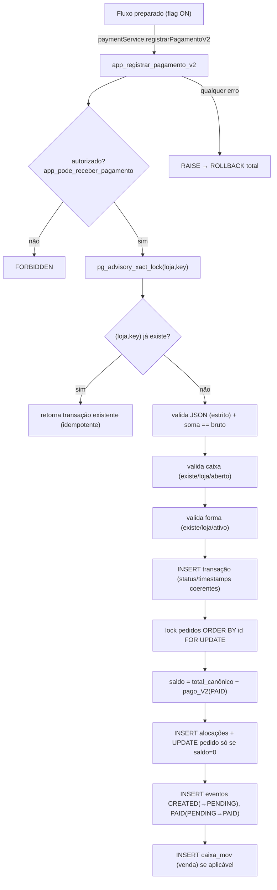

# Arquitetura — Fundação Financeira V2 (revisada/endurecida)

> Domínio de pagamentos **multiempresa, transacional, auditável e idempotente**,
> **aditivo** (não substitui o legado). Migration **118** + `src/lib/paymentService.js`,
> atrás da flag `PAYMENT_V2_ENABLED` (default `false`). Esta etapa **não** implementa
> gateway/PIX/cartão/NFC-e reais. Migration **ainda não aplicada** (revisão pré-homologação).

## 1. Visão geral

Legado `tab_pagamentos` **preservado** (nada apagado). Novo domínio:

| Objeto | Papel |
|---|---|
| `pagamento_transacoes` | 1 registro por operação (idempotente por `(loja_id, idempotency_key)`) |
| `pagamento_alocacoes` | rateio **N:N** pagamento × pedido |
| `pagamento_eventos` | trilha **append-only** (trigger bloqueia UPDATE/DELETE) |
| `app_pedido_valor_total(jsonb)` | valor canônico do pedido (= `orderTotal` do app) |
| `app_pode_receber_pagamento(bigint)` | autorização por `permissoes_acoes` |
| `app_registrar_pagamento_v2(...)` | RPC `SECURITY DEFINER` — cria tudo **atomicamente** |

## 2. Diagrama

## 3. Idempotência TÉCNICA × Saldo FINANCEIRO (distinção central)

- **Idempotência técnica** (retry/duplo clique): `UNIQUE (loja_id, idempotency_key)`.
  O cliente gera a `idempotency_key` **uma vez por intenção** e reusa em retries; a
  RPC devolve a transação existente sem duplicar. **Não** protege pagamentos
  *diferentes* do mesmo pedido.
- **Saldo financeiro** (duplo pagamento de negócio): a RPC calcula, no servidor,
  `saldo = valor_total_canônico − valor_já_pago_V2` e **rejeita** pedido já quitado
  (`PAYMENT_V2_PEDIDO_JA_PAGO`) ou alocação que exceda o saldo
  (`PAYMENT_V2_EXCEDE_SALDO`). Duas `idempotency_key` distintas disputando o último
  saldo **não** conseguem cobrar duas vezes (lock + recomputação de saldo).

## 4. Autorização funcional

`app_pode_receber_pagamento(loja)`: **super_admin** OU usuário **ativo da própria
loja** com módulo de caixa (`admin`/`cashier`/`op_caixa` em `ids_acesso`) e ação
`receber_pagamento`. A ação é **nova**; o modelo `permissoes_acoes` trata *chave
ausente = todas as ações permitidas* (default-allow, igual ao app), então usuários
existentes **permanecem autorizados** (retrocompatível). Só bloqueia quando o admin
configurar explicitamente as ações do módulo `cashier` **sem** `receber_pagamento`.
Não depende de validação do frontend.

## 5. Valor canônico e saldo do pedido

`app_pedido_valor_total(itens)` = **Σ (price × quantity)** dos itens persistidos —
espelho exato de `orderTotal()` do app. `price` é o **preço unitário final** já
gravado (promoções/combos/opções embutidas; o JSON persistido **não** tem campo de
desconto/adicional separado). Aceita chaves pt/en, é `IMMUTABLE` e defensivo (nunca
lança). `valor_já_pago_V2` conta **apenas** transações `status='PAID'` (valor
efetivamente confirmado). Fórmula documentada; o frontend **nunca** é autoridade.

## 6. Pagamento parcial

Suportado: uma alocação parcial **não** marca `status_pagamento='pago'`. A RPC só
marca `pago` quando `saldo_restante = 0`. Enquanto `saldo_restante > 0`, o pedido
permanece operacionalmente **não quitado** (mantém o `status_pagamento` atual —
**não** foi criado status legado `parcial`, pois o CHECK de `tab_pedidos` só admite
`aberto|solicitado|pago` e há consumidores desse enum). A **fonte da verdade** do
parcial é `pagamento_alocacoes` + `pagamento_transacoes`. **UI futura:** para exibir
“PARCIAL” sem quebrar o legado, calcular `saldo = app_pedido_valor_total − Σ
alocações PAID` e rotular `0 < pago < total` como parcial — apenas visual, sem novo
status no banco.

## 7. Atomicidade e ordem de lock

Toda a operação é **uma transação**: inserts + `UPDATE` de pedidos + caixa acontecem
juntos; qualquer `RAISE` faz **ROLLBACK total**. Os pedidos são bloqueados em **ordem
determinística** (`ORDER BY id FOR UPDATE`) após validar o shape, rejeitar
`pedido_id` duplicado e extrair os IDs únicos — reduz risco de **deadlock** em
pagamentos concorrentes com múltiplos pedidos.

## 8. Concorrência / idempotência concorrente

- `pg_advisory_xact_lock(hash(loja, key))` **serializa** duas chamadas simultâneas
  com a mesma `(loja, idempotency_key)`: a segunda espera e cai no `SELECT` que
  devolve a transação existente — **uma** transação, sem erro técnico ao usuário.
- **Rede de segurança**: mesmo assim, um `unique_violation` é capturado e re-seleciona
  a transação existente (retorna idempotente).
- Disputa pelo **último saldo** (keys diferentes): o `FOR UPDATE` no pedido serializa;
  a segunda recomputa saldo=0 → `PEDIDO_JA_PAGO`/`EXCEDE_SALDO`.

## 9. Caixa e forma de pagamento (validados no servidor)

- **Caixa** (se informado): existe, `loja_id = loja` e `status='aberto'` — senão
  `PAYMENT_V2_CAIXA_INVALIDO | _CROSS_TENANT | _FECHADO`. Nunca ignora caixa inválido.
- **Forma** (se informada): existe, `ativo=true` e (quando tenant-specific, i.e.
  `loja_id` não nulo) pertence à loja — senão `PAYMENT_V2_FORMA_INVALIDA |
  _CROSS_TENANT | _INATIVA`. Forma global (`loja_id` nulo) é aceita.

## 10. State machine e eventos imutáveis

- Transação manual nasce `PAID`. A trilha registra a transição **cronológica**:
  `CREATED (null→PENDING)` e, quando confirmado agora, `PAID (PENDING→PAID)` — sem o
  artefato antigo “CREATED null→PAID + PAID PENDING→PAID”.
- **Append-only real**: trigger `trg_pagamento_eventos_imutavel` bloqueia
  `UPDATE/DELETE` em `pagamento_eventos` para **todos** (inclusive o dono). FK
  `pagamento_eventos → pagamento_transacoes` é **RESTRICT** (nunca apaga evento em
  cascata). Estornos/cancelamentos futuros são **novos eventos/estados**, nunca
  edição/remoção. `pagamento_alocacoes → pagamento_transacoes` é `CASCADE` (filho),
  mas como a transação não é apagada (eventos RESTRICT), as alocações também
  persistem — cancelamento é por **estado**, não por DELETE.

## 11. Timestamps

`processado_em` só é setado quando o estado é `PROCESSING/AUTHORIZED/PAID`;
`confirmado_em` só quando `PAID`. Uma transação `PENDING` (futuro gateway) **não**
parece processada/confirmada.

## 12. RLS, grants e consistência multiempresa

- **RLS** habilitada nas 3 tabelas; `SELECT` **apenas a `authenticated`** sob
  `super OR loja_id = app_loja_id()`. **`anon` sem nenhum acesso financeiro**
  (revoke all). Escrita direta revogada de `authenticated` — só a RPC (definer)
  grava. RPC: `REVOKE FROM PUBLIC` + `GRANT EXECUTE TO authenticated`.
- **Consistência de tenant no banco**: FK **composta** `pagamento_alocacoes
  (loja_id, pedido_id) → tab_pedidos(loja_id, id)` (habilitada por índice único
  aditivo em `tab_pedidos(loja_id,id)`) impede fisicamente alocação cross-tenant.
  A RPC garante `pagamento.loja = alocacao.loja = pedido.loja = caixa.loja =
  forma.loja(quando tenant-specific)` antes de persistir.

## 13. Fluxo legado (preservado) e feature flag

`registrarPagamento`/`baixarComandas` continuam **iguais** com a flag desligada
(default). `PAYMENT_V2_ENABLED=true` habilita a RPC **apenas** em fluxos
explicitamente preparados. Nenhum fluxo antigo foi trocado nesta etapa. `App.jsx` e
`src/lib/supabase.js` **não** foram alterados.

## 14. Estratégia de migração / gateway / Pix / fiscal

- **Migração:** preflight (`payment-v2-preflight.sql`, só leitura) → aplicar 118 em
  homologação → integração (`payment-v2-integration.sql`) → backfill seguro (loja
  inferível, migration posterior) → endurecimento (`plano-hardening-multiempresa.md`).
- **Gateway:** `provider/provider_transaction_id/nsu/tid/authorization_code` prontos;
  ciclo `PENDING→PROCESSING→AUTHORIZED→PAID/DECLINED` por eventos; webhook idempotente
  por `provider_event_id`; segredos no servidor.
- **Pix:** `pix_e2e_id` reservado; cobrança `PENDING`→confirmação `PAID`.
- **Fiscal:** a NFC-e/NF-e reais consumirão `pagamento_transacoes` (forma/valor pago,
  grupo `pag/detPag`), vinculando ao documento (`loja_fiscal_nfce`/futura `_nfe`),
  no mesmo padrão de tenant forte e numeração atômica da 117.

## 15. Testes

**Unitários (Vitest — `paymentService.test.js`, sem banco):** flag off; catálogos;
idempotency key (v4, CSPRNG); normalização/soma; validação (bruto≤0, taxa negativa,
líquido negativo, sem alocação, sem pedido_id, valor≤0, alocação>pagamento,
soma≠pagamento, **parcial coerente = só valida soma, NÃO decide quitação**);
mapeamento dos **novos códigos** (FORBIDDEN, CAIXA_*, FORMA_*, JA_PAGO, EXCEDE_SALDO);
fiação da RPC (mock) incl. `MIGRACAO_PENDENTE`. **Os unitários não substituem os SQL.**

**Integração (SQL — `supabase/tests/payment-v2-integration.sql`, HOMOLOGAÇÃO, com
ROLLBACK):** valor canônico; pagamento integral; sem permissão→FORBIDDEN; parcial não
quita; 2º pagamento quita; excede saldo / já pago; idempotência sequencial;
cancelado; cross-tenant (pedido/caixa/forma); forma inativa; soma inválida; pedido
inexistente; JSON inválido/duplicado; evento imutável; rollback após erro no meio.
**Concorrência real** (mesma key simultânea; duas keys pelo último saldo) via
instruções **Sessão A / Sessão B** no rodapé do script.
