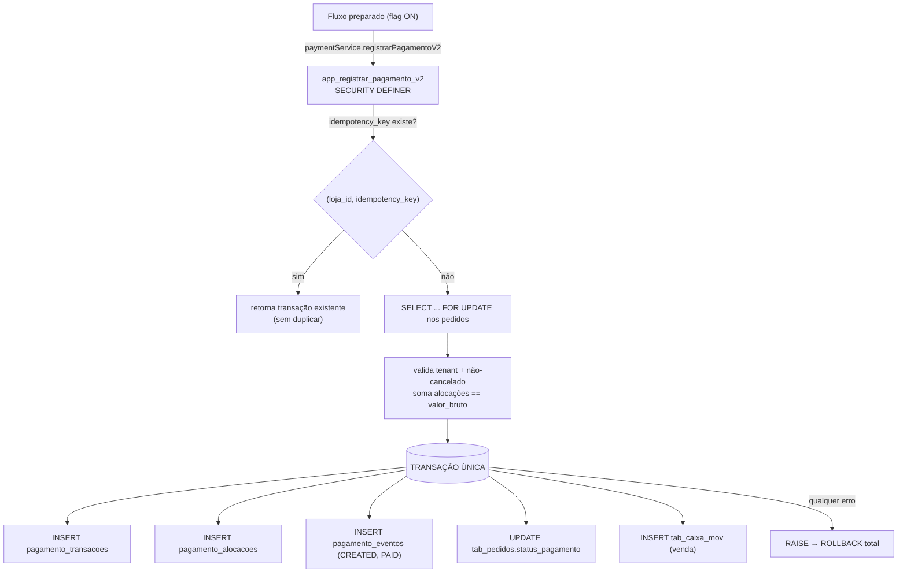

# Arquitetura — Fundação Financeira V2

> Domínio de pagamentos **multiempresa, transacional, auditável e idempotente**,
> **aditivo** (não substitui o legado). Introduzido pela **migration 118** +
> `src/lib/paymentService.js`, atrás da flag `PAYMENT_V2_ENABLED` (default `false`).
> Esta etapa **não** implementa gateway/PIX/cartão/NFC-e reais.

## 1. Visão geral

O legado `tab_pagamentos` é **preservado** (nada é apagado). O novo domínio vive
em três tabelas e uma RPC transacional:

| Objeto | Papel |
|---|---|
| `pagamento_transacoes` | 1 registro por operação de pagamento (idempotente por loja) |
| `pagamento_alocacoes` | rateio **N:N** pagamento × pedido |
| `pagamento_eventos` | trilha **append-only** (auditoria/rastreabilidade) |
| `app_registrar_pagamento_v2(...)` | RPC `SECURITY DEFINER` — cria tudo **atomicamente** |

## 2. Diagrama

## 3. Status e eventos

**Status da transação** (`chk_pt_status`): `PENDING`, `PROCESSING`, `AUTHORIZED`,
`PAID`, `DECLINED`, `CANCELLED`, `REFUNDED`, `PARTIALLY_REFUNDED`, `EXPIRED`,
`ERROR`. No fluxo **manual** atual, a transação nasce já `PAID`; os demais estados
existem para o futuro (gateway/PIX).

**Eventos** (`chk_pe_tipo`, append-only): `CREATED`, `PROCESSING`, `AUTHORIZED`,
`PAID`, `DECLINED`, `CANCELLED`, `REFUNDED`, `ERROR`. Manual gera `CREATED` + `PAID`.

Valores financeiros são **sempre ≥ 0** (`chk_pt_valores_nao_neg`); estornos serão
representados por transações/eventos próprios (`REFUNDED`), nunca por valor negativo.
Invariante: `valor_liquido = valor_bruto - valor_taxa` (`chk_pt_liquido`).

## 4. Idempotência

- **Chave:** `UNIQUE (loja_id, idempotency_key)` em `pagamento_transacoes`.
- O cliente gera `idempotency_key` (UUID) **uma vez por intenção de pagamento** e a
  reusa em retries. A RPC, ao encontrar a chave, **retorna a transação existente**
  (`idempotente: true`) sem duplicar — elimina duplo pagamento por retry/duplo clique.
- `provider_event_id` tem índice único parcial para **idempotência futura de webhook**.

## 5. Atomicidade

A RPC roda como **uma transação**: inserts (transação + alocações + eventos),
`UPDATE` dos pedidos e movimento de caixa acontecem **juntos**. Qualquer falha
(`RAISE EXCEPTION`) faz **ROLLBACK total** — nunca há pedido "pago" sem pagamento,
pagamento sem alocação, nem alocação cross-tenant persistida.

## 6. RLS e isolamento multiempresa

- Todas as tabelas V2: **RLS habilitada**; policy de `SELECT` = `super OR loja_id =
  app_loja_id()`.
- **Cliente não escreve direto** — `INSERT/UPDATE/DELETE` revogados de `anon`/
  `authenticated`. Toda escrita passa pela RPC `SECURITY DEFINER`, que **resolve a
  loja no servidor** (`app_loja_id()`/super) e **não confia** no `loja_id` do
  frontend.
- `pagamento_eventos`: `SELECT` para a própria loja; **sem** policy de escrita para o
  cliente ⇒ **append-only** efetivo (só a RPC grava). `UPDATE/DELETE` proibidos.
- A RPC busca e **bloqueia os pedidos no servidor** (`FOR UPDATE`), confirma que
  pertencem à loja e que não estão cancelados.

## 7. Modelo N:N pagamento × pedido

`pagamento_alocacoes` liga um pagamento a um ou mais pedidos, com `valor` por pedido.
- `UNIQUE (pagamento_id, pedido_id)` impede alocação duplicada.
- `CHECK (valor > 0)`.
- **Consistência de tenant garantida no servidor:** `pagamento.loja_id =
  alocacao.loja_id = pedido.loja_id` (a RPC valida; não vem do frontend).
- **Soma:** `Σ alocações = valor_bruto` (validado na RPC). Cobre "alocação maior que
  o pagamento" e "soma diferente do pagamento". Pagamento **parcial** (menor que a
  conta) é suportado — o parcial é em relação à conta; a transação permanece
  internamente consistente.

## 8. Fluxo legado (preservado)

`registrarPagamento` (insert direto em `tab_pagamentos`) e `baixarComandas`
continuam **exatamente iguais** com a flag desligada. O legado **não** é removido.
`tab_pagamentos` segue como histórico. A migração de leitura/relatórios para V2 é
incremental e fora desta etapa.

## 9. Feature flag

`PAYMENT_V2_ENABLED` (em `src/lib/paymentService.js`, override
`VITE_PAYMENT_V2_ENABLED=true`). **Default `false`.**
- `false` → nenhum comportamento muda; a RPC nem é chamada.
- `true` → **apenas** os fluxos explicitamente preparados podem chamar
  `registrarPagamentoV2(...)`. Nenhum fluxo antigo foi trocado automaticamente.

## 10. Estratégia de migração

1. Rodar `supabase/diagnostics/payment-v2-preflight.sql` (homolog e prod) — medir
   órfãos (`loja_id NULL`, FKs, tenant inferível).
2. Aplicar a **118** em homologação; rodar os testes de integração (§13).
3. Backfill seguro de `loja_id` legado (candidatos com tenant único inferível) —
   **migration posterior**, com revisão humana (nunca inventar loja).
4. Endurecimento (`loja_id NOT NULL`, FK `RESTRICT`) — **migration posterior**
   (ver `plano-hardening-multiempresa.md`).
5. Preparar 1 fluxo piloto (ex.: baixa de comanda no caixa) para usar V2 com a flag
   ON em homologação; comparar com o legado; então promover.

## 11. Estratégia para gateway (futuro)

- `provider`/`provider_transaction_id`/`nsu`/`tid`/`authorization_code` já existem.
- Autorização assíncrona: transação nasce `PENDING`→`PROCESSING`→`AUTHORIZED`→`PAID`
  (ou `DECLINED`), cada passo é um **evento**. Webhook do provider grava via
  RPC/back-end autorizado usando `provider_event_id` (idempotência de webhook).
- Segredos do gateway ficam **no servidor** (Vercel/Edge), nunca no frontend.

## 12. Estratégia para Pix (futuro)

- `pix_e2e_id` (EndToEndId) já reservado + índice. Cobrança gera `PENDING`;
  confirmação (webhook/consulta) muda para `PAID` com evento e `pix_e2e_id`.
- Conciliação por `pix_e2e_id`; idempotência por `idempotency_key`.

## 13. Testes

**Unitários (Vitest — `src/lib/paymentService.test.js`, rodam sem banco):** flag
off; catálogos de status/eventos; idempotency key; normalização/soma; validação
(bruto ≤ 0, taxa negativa, líquido negativo, sem alocação, sem pedido_id, valor ≤ 0,
alocação > pagamento, soma ≠ pagamento, parcial coerente); mapeamento de erros;
fiação da RPC (mock) incluindo reuso de idempotency_key e `MIGRACAO_PENDENTE`.

**Integração (SQL, rodar em HOMOLOGAÇÃO — comportamento de banco):**
- mesma `idempotency_key` 2× → **uma** transação;
- loja A tentando pedido da loja B → `PAYMENT_V2_CROSS_TENANT`;
- pedido inexistente → erro; pedido cancelado → erro;
- soma das alocações ≠ pagamento → erro;
- duas chamadas concorrentes (mesma key) → sem duplicidade (unique + FOR UPDATE);
- erro no meio (ex.: pedido de outra loja na lista) → **nada** persistido;
- `pagamento_eventos` é **append-only** (UPDATE/DELETE negados ao cliente);
- RLS: sessão da loja A **não lê** pagamento da loja B.

> Estes exigem um banco com sessões JWT de duas lojas — executar no projeto de
> homologação após aplicar a 118. Não rodam no Vitest (sem banco).

## 14. Integração futura com o fiscal

A NFC-e/NF-e reais consumirão o **pagamento** como fonte da forma de pagamento e do
valor efetivamente pago (grupo `pag`/`detPag` do leiaute), vinculando
`pagamento_transacoes` ao documento fiscal emitido (`loja_fiscal_nfce`/futura
`loja_fiscal_nfe`) — mantendo o mesmo padrão de tenant forte e numeração atômica já
usado na 117. A trilha `pagamento_eventos` alimenta a conciliação fiscal-financeira.
